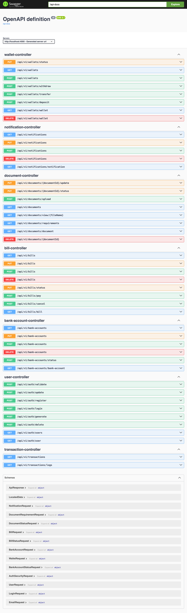

# Sudan Yalla Pay - System Overview

## 1. Project Structure
### Directory Tree
```
.
├── src
│   ├── main
│   │   ├── java
│   │   │   └── com
│   │   │       └── sudagoarth
│   │   │           └── sudanyallapay
│   │   │               ├── BankAccounts
│   │   │               ├── Bills
│   │   │               ├── Cards
│   │   │               ├── Documents
│   │   │               ├── Enums
│   │   │               ├── Merchants
│   │   │               ├── Notifications
│   │   │               ├── Security
│   │   │               ├── Transactions
│   │   │               ├── Users
│   │   │               ├── Wallets
│   │   │               ├── exceptions
│   │   │               ├── utils
│   │   │               └── SudanyallapayApplication.java
│   │   └── resources
│   └── test
│       └── java
│           └── com
│               └── sudagoarth
│                   └── sudanyallapay
└── uploads
```

## 2. Login & Registration Screen
### Purpose: 
Allow users to register and log in securely.

### UI Elements:
- **Login Form:** Email/Phone, Password, "Forgot Password" link, Login Button.
- **Registration Form:** Full Name, Email, Phone Number, Password, Confirm Password, National ID (optional), Date of Birth.
- **Buttons:** "Login", "Register", "Continue with Google/Facebook".
- **Validation Messages:** Show when incorrect data is entered.

## 3. User Dashboard
### Purpose:
Show a summary of wallet balance, transactions, and quick actions.

### UI Elements:
- **Wallet Balance:** Display user balance in SDG currency.
- **Recent Transactions:** A scrollable list of the latest 5 transactions.
- **Quick Actions:** Buttons for Deposit, Withdraw, Transfer, Pay Bill.
- **Notifications Icon:** Displays unread messages.

## 4. Transactions Screen
### Purpose:
Show the history of all transactions with filtering options.

### UI Elements:
- **Filter by Type:** Dropdown menu for Deposit, Withdrawal, Transfer, Bill Payment, Top-up.
- **Transaction List:** Each item includes Transaction Type, Amount, Status (Pending, Completed, Failed), Date.
- **Search Bar:** Find transactions by reference number.

## 5. Wallet Management Screen
### Purpose:
Allow users to view and manage their wallet.

### UI Elements:
- **Balance Display:** Shows the available balance.
- **Linked Bank Accounts & Cards:** List of connected payment methods.
- **Deposit/Withdraw Buttons:** Enable adding or withdrawing funds.
- **Transaction History:** Filter transactions by Deposit, Withdrawal, Transfer, Bill Payment.

## 6. Bank Accounts & Cards Screen
### Purpose:
Allow users to add and manage their bank accounts & cards.

### UI Elements:
- **List of Added Accounts & Cards:** Show Bank Name, Account Number, Status (Active/Inactive).
- **Add New Account/Card Button:** Form with fields for Bank Name, Account Number, IBAN, SWIFT Code.
- **Card Management Section:** Show Card Number (masked), Expiry Date, Card Type (Debit, Credit, Prepaid).

## 7. Bill Payment Screen
### Purpose:
Allow users to pay their bills.

### UI Elements:
- **List of Pending Bills:** Show Biller Name, Due Date, Amount, Status (Pending/Paid).
- **Pay Now Button:** Opens a confirmation modal before processing payment.
- **Payment Receipt:** Display proof of payment after successful transactions.

## 8. Merchant Dashboard
### Purpose:
Allow businesses to manage their accounts & revenue.

### UI Elements:
- **Business Information:** Show Business Name, Registration Number, Contact Details.
- **Wallet Overview:** Show Current Balance & Recent Transactions.
- **Revenue Insights:** Graphs showing daily, weekly, monthly earnings.
- **Transaction History:** Similar to the user transaction screen but filtered for business payments.

## 9. Notifications Screen
### Purpose:
Show important messages and alerts to users.

### UI Elements:
- **List of Notifications:** Each item has Message, Date, Read/Unread Status.
- **Mark All as Read Button:** Clears unread notifications.
- **Clickable Items:** Redirect users to relevant actions (e.g., successful transactions, bill reminders).

## 10. Profile & Settings Screen
### Purpose:
Allow users to update their personal information.

### UI Elements:
- **Profile Picture:** Upload or update an image.
- **Personal Details:** Name, Email, Phone, Date of Birth, National ID (optional).
- **Security Settings:** Change Password, Enable Two-Factor Authentication (2FA).
- **Logout Button:** Ends the user session securely.

---

## Database Schema Overview
### **Users Table**
Stores user information including contact details, authentication, and profile settings.

### **Auth Security Table**
Handles OTP-based authentication and security measures.

### **Wallets Table**
Manages user balances, transactions, and linked accounts.

### **Transactions Table**
Stores all financial transactions, including deposits, withdrawals, and transfers.

### **Bank Accounts & Cards Table**
Holds user-linked payment methods for deposits and withdrawals.

### **Bills Table**
Manages bill payments and due payments associated with users.

### **Notifications Table**
Stores alerts and updates relevant to user activities.

### **Merchants Table**
Manages business accounts and their associated financial transactions.

🚀 **This document serves as a high-level breakdown of the Sudan Yalla Pay system architecture and user journey.**

***Screen Capture PDF***

